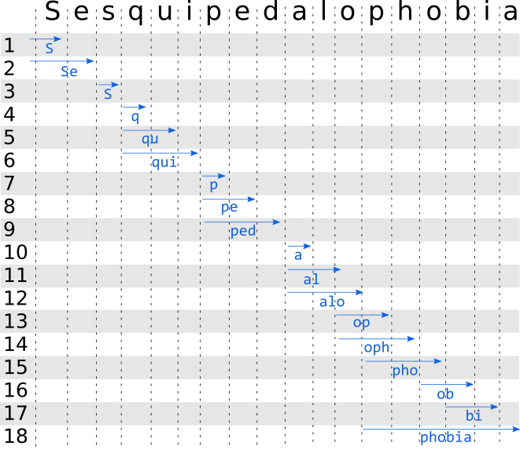

# Abstract

Tokenization into words or sub-word units is a key component of Natural Language Processing pipeline. Modern approaches such as Byte Pair Encoding ([Sennrich et al., 2015](https://arxiv.org/abs/1508.07909)), WordPiece or SentencePiece ([Kudo et al., 2018](https://arxiv.org/abs/1808.06226)) segment rare words into sub-tokens in order to limit the size of the resulting vocabulary, which in turn results in more compact embedding matrices, reduced memory footprint and better generalization. These would for example split the word `unaffable` into `[un, ##aff, ##able]` where the prefix `un` could share its representation with other negating prefixes for other words, for example `[un, ##expected]`.

I believe that familiarity with the implementation details, benefits and limitations of these algorithms is key to understanding the same for the end-to-end models using these tokenizers. For example, while Byte Pair Encoding is a morphological tokenizer agglomerating common character pairs into subtokens, the SentencePiece unigram tokenizer is a statistical model that uses a unigram language model to return the statistically most likely segmentation of an input. While information on the popular Byte Pair Encoding (BPE) is [available](https://web.stanford.edu/class/cs224n/slides/cs224n-2019-lecture12-subwords.pdf) with detailed information on the encoding algorithms, I felt working examples (with acceptable real world performance) of the sentence piece unigram encoding algorithm were missing. Not meant at being a replacement for the [reference article](https://arxiv.org/abs/1804.10959), this article aims at providing an illustrated walk-through the Sentence Piece unigram model encoding algorithm. However, the scale of the project (and potential lack of familiarity with C++) can make a deep-dive through the source code a daunting task for the interested data scientist willing to better understand the algorithm.
 
 [Rust](https://www.rust-lang.org) has been shown to be a language that is adequate for high-performance tokenization (for example in my [rust-tokenizers](https://crates.io/crates/rust_tokenizers) project or Hugging Face's [tokenizers](https://crates.io/crates/tokenizers)). The Rust programming language offers a number of features making it a great language for natural language processing (robust and modern string handling, memory safety, effective multi-threading application design, speed and readability). This article provides two example implementations for the SentencePiece ending step in Rust. Importantly, I will show that the raw performance of a language should not replace careful design of the algorithms. This article proposes two implementations that are an order of magnitude apart in terms of execution speed, with the fastest being comparable to the reference C++ code. With both implementation fitting in around 150 lines of code, they make a good learning reference for both Rust and the SentencePiece algorithm itself. 

# An overview of the SentencePiece unigram model

SentencePiece refers to both a probabilistic word segmentation algorithm (usually the unigram model) and a library (implemented in C++). The SentencePiece unigram model decomposes an input into a sequence of tokens that would have the highest likelihood (probability) to occur in an unigram language model, i.e. the decomposition that maximizes the product of the sub-tokens probability (or more conveniently the sum of their log probability). 

Mathematically, the objective of the tokenization is to identify the subtokens $$(x_1, x_2, \dots, x_n)$$  from the set of segmentation candidates $$S(V)$$ for an input $$X$$ such as
$$\newcommand{\argmax}{\arg\!\max}$$

$$P(X) = \prod\limits_{i=1}^{M} P(x_i)$$

$$(x_1, x_2, \dots, x_n) = \argmax_{x \in S(V)} P(X)$$

The individual token probabilities are built such as:

$$\sum_{Vocabulary}P(x) = 1$$

(from [Kudo et al., 2018](https://arxiv.org/abs/1808.06226)). Note that log probabilities are usually used rather than the direct probabilities so that the most likely sequence can be derived from the sum of log probabilities rather than the product of probabilities.

The algorithm consists of two macro steps: the training on a large corpus and the encoding of sentences at inference time. A detailed description of the training mechanism of the unigram model is beyond the scope of this article, and the focus will rather be on the encoding mechanism.

## 1. Training

The SentencePiece unigram model aims at maximizing the likelihood of a unigram language model by starting f which is pruned iteratively using the Expectation Maximization algorithm. 

 The SentencePiece tokenization aims at finding the tokenization that maximizes the likelihood of a language model trained using this tokenization. Because these depend on each other, the Expectation Maximization algorithm is used to build this tokenization model with the following steps:
 
1. Initiate a reasonably large seed vocabulary (generated for example from the ([Suffix Array algorithm, Nong et al.](https://ieeexplore.ieee.org/document/4976463)) from a training corpus. Define a desired vocabulary size that is smaller than the initial vocabulary (*note: this differs from BPE training where the vocabulary grows until it reaches the target size!*)
2. Repeat the following Expectation Maximization steps until convergence:
    1. Estimate the probability of each vocabulary token using frequency counts in the training corpus
    2. Use this probability to tokenize the text using the encoding algirthm described in the following section ([Viterbi decoding algorithm](https://en.wikipedia.org/wiki/Viterbi_algorithm)).
    3. Compute the loss for every vocabulary token, loss being the impact of dropping said token from the vocabulary on the overall likelihood $$\mathcal{L}$$.
    4. Prune the vocabulary by keeping the top $$x\% (e.g. 80\%)$$) tokens with the lowest loss. In order to eliminate the risk of an out-of-vocabulary character item, single characters are usually excluded from this pruning step.

## 2. Encoding

### Algorithm

Encoding (the focus of this article) is used during the training maximization step of EM and at inference in order to encode a new input text. The encoding is done using the [Viterbi decoding algorithm](https://en.wikipedia.org/wiki/Viterbi_algorithm) consisting of 2 macro steps: a forward step (where the possible sub-tokens are identified) and a backward step (where the most likely decoding sequence is identified). These steps are described in detail in this [excellent article](https://everdark.github.io/k9/notebooks/ml/natural_language_understanding/subword_units/subword_units.nb.html). 

1. The forward steps identifies the sub-token with the highest probability at each character position of the word. The result at the end of the forward pass is a list of best sub-tokens ending at each character position of the input string. Note that this best sub-token at a given ending character position takes into account the raw likelihood of the sub-token *and* the likelihood of the best token sequence leading to it (as opposed to the probability provided in the vocabulary that does not consider the surrounding context). The Viterbi algorithm uses the fact that the likelihood of a token ending at character position `end_idx` and starting at position `start_idx`, is given by $$\mathcal{L}(Best\:sequence\:up\:to\:start\:idx) + \mathcal{L}(subtoken)$$. Two methods for this forward pass will be described in the following with a proposed implementation in Rust. In both case the high level algorithm forward pass accomplishes the following:

~~~
1. initialize best_ending_subtokens = [None] * len(input)
1. For end_idx in [0:len(input)]:
    best_ending_subtokens[end_idx] = identify_best_token_ending_at(end_idx)
~~~
the `identify_best_token_ending_at` method is described in the following sections of this article. 

2. The backward pass takes this list of most likely tokens ending at each position to decode the sequence starting from the end and building its way back to the beginning.

~~~
end = len(input)
best_tokens = viterbi_forward(input) (list of size N with best ending token at each character position)
sub_tokens = []
While end > 0:
    best_token_len = best_tokens[end]
    sub_tokens.push(best_token_len)
    end = end - len(best_token_len) 
End while
reverse(sub_tokens)
~~~

### Example 
The illustrations are heavily inspired by another recommended read on the SentencePiece unigram algorithm by [Kyle Chung](https://everdark.github.io/k9/notebooks/ml/natural_language_understanding/subword_units/subword_units.nb.html). Let's take the following example word to tokenize. : 
> Sesquipedalophobia (fear of long words)

The reference SentencePiece library with a pretrained tokenizer used by [XLNet](https://arxiv.org/abs/1906.08237) tokenizes this long and rare word as :
```python
import sentencepiece
sp_model = sentencepiece.SentencePieceProcessor()
sp_model.Load('xlnet-base-cased-spiece.model')

sp_model.EncodeAsPieces("Sesquipedalophobia")
```
`['▁Se', 's', 'qui', 'ped', 'alo', 'phobia']`

The forward pass identifies the most likely token ending at each character position (more on that to follow):



By construction, the forward pass provides the token with the highest likelihood to occur at a given position. The decoding then happens backwards: by starting at the last character, we are sure that the token ending at this position is the most likely. We then only have to walk the proposed sub-tokens from end to start:


The following will walk through two implementations of the algorithm in Rust.

# First implementation

As a reminder the forward pass of the algorithm requires identifying the most likely token at each character position of the input:

~~~
1. initialize best_ending_subtokens = [None] * len(input)
1. For end_idx in [0:len(input)]:
    best_ending_subtokens[end_idx] = identify_best_token_ending_at(end_idx)
~~~

One potential implementation of the `identify_best_token_ending_at` method is to take slices of the substring ending at `end_idx` with incremental start position and calculating the likelihood for each slice. This results in a nested `for` loop to generate these slices. For each slice, the log probability or the token is equal to the log probability of the slice itself added to the probability of the best sequence leading to it. To implement this Viterbi algorithm the best slices and best scores are stored for each ending position and can be re-used to populate the most likely tokens ending at subsequent positions. This is the proposed implementation by [Kyle Chung](https://everdark.github.io/k9/notebooks/ml/natural_language_understanding/subword_units/subword_units.nb.html): 

~~~
1. initialize best_ending_subtokens = [None] * len(input)
2. initialize best_ending_subtokens_scores = -inf * len(input)
2. For end_idx in [0:len(input)]:
        For start_idx in [0:end_idx]:
            substring = input[start_idx:end_idx]
            local_score = best_ending_subtokens_scores[start_idx] + score(input[start_idx:end_idx])
            If local_score > best_ending_subtokens_scores[end_idx]:
                best_ending_subtokens[end_idx] = substring
                best_ending_subtokens_scores[end_idx] = local_score
            End if
        End for
    End for
~~~

The first step is to define a SentencePiece model holding the pre-trained vocabulary and tokens log-likelihood:

```rust
pub struct SentencePieceModel {
    pub vocab: HashMap<String, (f32, i64)>
}

impl SentencePieceModel {
    pub fn from_file(path: &str) -> SentencePieceModel {
        let mut f = File::open(path).unwrap();
        let mut contents = Vec::new();
        f.read_to_end(&mut contents).unwrap();

        let proto = parse_from_bytes::<ModelProto>(contents.as_slice()).unwrap();
        let mut vocab = HashMap::new();
        for (idx, piece) in proto.get_pieces().iter().enumerate() {
            vocab.insert(piece.get_piece().to_owned(), (piece.get_score(), idx as i64));
        }
        SentencePieceModel { vocab }
    }
}
```
This reads a pretrained SentencePiece model using the [associated Protobuf](https://github.com/google/sentencepiece/blob/master/src/sentencepiece_model.proto). The vocabulary is stored in a `HashMap` with the token strings as keys and their `(log score, index)` as keys.

To hold the results of the forward pass, a utility structure is created, called `Node` (that would be part of the forward Viterbi lattice). This hold the token score, vocabulary index, start and end character position and a __reference__ to the token string (to avoid unnecessary copying):
```rust
#[derive(Debug, Clone, Copy)]
pub struct Node<'a> {
    pub text: &'a str,
    pub score: f32,
    pub index: i64,
    pub start: usize,
    pub end: usize,
}
```

The forward pass outputs a list of optional Nodes. 
1. The best node and best score are populated with `None` and `std::f32::NEG_INFINITY` respectively. 
2. Slices are taken by looping through `end_idx` and `start_idx`. 
3. Each slice is looked-up in the vocabulary. If it is found, its raw score is retrieved.
4. Its true local score (taken into account the probability of the best sequence leading to that token) is calculated by looking up the best score for the sequence ending at the start index for this token.
5. If the local score is greater than the store value, the best token and best score are updated with the current value
6. If after looping through all possible start values for a given end value the score is still `std::f32::NEG_INFINITY`, this means the character does not exist in the vocabulary. In this case an unknown `Node` is created. The score for the sequence ending at this unknown character is reset to 0 to allow for decoding.

```rust
impl SentencePieceModel {
    //...

    pub fn decode_forward<'a>(&'a self, text: &'a str) -> Vec<Option<Node>> {
        let mut char_positions = text
            .char_indices()
            .map(|(pos, _)| pos)
            .collect_vec();
        char_positions.push(text.len());
        let mut results = vec!(None; char_positions.len());
        let mut scores = vec!(std::f32::NEG_INFINITY; char_positions.len());
        scores[0] = 0f32;
    
        for char_end in 0..char_positions.len() {
            for char_start in 0..char_end {
                let sub_text = &text[char_positions[char_start]..char_positions[char_end]];
                if let Some(subtoken) = self.vocab.get(sub_text) {
                    let local_score = scores[char_start] + subtoken.0;
                    if local_score > scores[char_end] {
                        results[char_end] = Some(Node {
                            text: sub_text,
                            score: local_score,
                            index: subtoken.1,
                            start: char_start,
                            end: char_end
                        });
                        scores[char_end] = local_score;
                    }
                }
            }
            if scores[char_end] <= std::f32::MIN {
                results[char_end] = Some(Node {
                    text: &text[char_positions[char_end - 1]..char_positions[char_end]],
                    score: std::f32::MIN,
                    index: 0,
                    start: char_end - 1,
                    end: char_end
                });
                scores[char_end] = 0f32;
            }
        }
        results
    }
}
```

From this vector of `Nodes`, the backward pass is far simpler and navigates the array starting from the last node. The next position is stored in the node itself. The backward pass returns a re-ordered list of best nodes for this tokenization. Here again references are used rather than the actual objects to avoid unnecessary copies:

```rust
impl SentencePieceModel {
    //...
    pub fn decode_backward<'a>(&'a self, nodes: &'a Vec<Option<Node<'a>>>) -> Vec<&'a Node> {
        let mut next_node = nodes.last().unwrap();
        let mut best_sequence = vec!();

        while next_node.is_some() {
            let node_value = next_node.as_ref().unwrap();
            best_sequence.push(node_value);
            next_node = &nodes[node_value.start];
        };
        best_sequence.reverse();
        best_sequence
    }
}
```

The final tokenization combines the two steps and returns a string:
```rust
impl SentencePieceModel {
    //...
    pub fn tokenize(&self, text: &str) -> Vec<String> {
        let text = text.replace(' ', "\u{2581}");
        let text = text.as_str();
        let output = self.decode_forward(text);
        let decoded = self.decode_backward(&output);
        decoded.into_iter().map(|node| node.text.to_string()).collect()
    }
}
```

Let's try this out:
```rust
fn main() {
    let text = " Sesquipedalophobia";
    let tokenizer = SentencePieceModel::from_file("E:/Coding/notebooks/xlnet-base-cased-spiece.model");

    let output = tokenizer.tokenize(text);
}
```
`["▁Se", "s", "qui", "ped", "alo", "phobia"]`

All good, we get the expected output! The actual algorithm involves optional lower-casing, NFKC normalization and replaces the whitespaces by `\u{2581}`. These have been ignored in this simple example.

It works but how fast does it run compared to the C++ implementation? Let's benchmark it from its Python bindings:
```python
%timeit -n 100 sp_model.EncodeAsPieces("The quick brown fox jumps over the lazy dog")
%timeit -n 100 sp_model.EncodeAsPieces("All human beings are born free and equal in dignity and rights. They are endowed with reason and conscience and should act towards one another in a spirit of brotherhood.") 
```
([article 1 or the Universal Declaration of Human Rights](https://www.un.org/en/universal-declaration-human-rights/))

This C++ implementation takes **9.7µs** and **29.8µs**, respectively. The Rust version (with all compiler optimizations) takes **29µs** for the first and **614.5µs** for the second sentence. 

*Oops!* That is 3 times faster than C++ for the short sentence and more than an order of magnitude slower for longer sentence.

Looking back at the implementation, one can notice the inefficiency during the forward pass: the nested loop will causes `N²` lookups into a very large `HashMap`. Using the [hashbrown](https://github.com/rust-lang/hashbrown) port of  Google's  [SwissTable](https://abseil.io/blog/20180927-swisstables) allows to take these times down to 14.2µs and 238.9µs. This is better but we definitely still have a problem for longer inputs because of this `N²` complexity!

# Second implementation

The nested `for` loop over the entire input length is too costly, especially for longer inputs. Intuitively, as the `end_idx` cursor moves towards the end of the input, one can guess that low values for `start_idx` of the substring are unlikely to be in the vocabulary. Therefore, one should only explore part of the space of substrings ending (or starting) at a given input character position. The [reference C++ implementation](https://github.com/google/sentencepiece/blob/master/src/unigram_model.cc) relies on [Directed Acrylic Graphs](https://en.wikipedia.org/wiki/Directed_acyclic_graph).

The main idea is to build a character-based directed acrylic graph (DAG) from the pre-trained tokens and their scores. Every time we insert a token, we also add the character-based path to the token if it does not yet exist. A difference is made between the DAG nodes that do exist in the SentencePiece model (marked as leaves) and the nodes that do not have a matching. Every token is pushed by being added to the children of the token containing all characters except the last one:
1. Get the characters of the token to insert
2. Start at the DAG root node. If the first character is in the children of the root, move to that node. Otherwise create it as a non-leaf node.
3. Select the character node as the current node.
4. Continue iterating through the characters, checking if the next character in the token to insert is in the children and adding if required.
5. When the last character is reached, mark the current node as a leaf node and store the token score (log probability) on the node.

The following figure illustrates the population of the DAG assuming the first 3 words are `cat`, `carp` and `car`.


When "cat" is fist inserted, the DAG is empty and therefore the intermediate nodes "c", "ca" and "cat" need to be created. At the last character position (node "cat"), the node is marked as a leaf. When "carp" is inserted, the nodes "c" and "ca" already exist and the graph is navigated. The child node "car" cannot be found in "ca" children, and is therefore created. At this point it is marked as a non-leaf node, and carp" is added to its children as a leaf node. When the token "car" is inserted to the DAG, all nodes already exist. We navigate the graph to the existing node "car", mark it as a leaf and store its log probability.

This DAG allows to quickly get all of the possible token that share the same prefix for a given substring. However, one can note that while this was done by iteratively checking *every* substring of a given input in the previous method (therefore requiring `N` operations for a substring of length `N`), we can now navigate the DAG by feeding the character sequence from the substring query. We keep track of all of the leaf node encountered along the way, and stop early when we cannot find the next character in the current node children. This means that for any substring, we do at most `k` operations (where k is the depth of the DAG) and in most cases far less.

By asking for all DAG nodes sharing a prefix with "carpooling", we'd obtain the result `["car", "carp"]` in 5 operations as opposed to 10 (length of carpooling), as illustrated below:


The Viterbi forward pass can be re-written to take advantage of this efficient way of recovering tokens sharing a common prefix:

~~~
1. initialize best_ending_subtokens = [None] * len(input)
2. initialize best_ending_subtokens_scores = -inf * len(input)
2. For start_idx in [0:len(input)]:
        substring = input[start_idx:]
        matches = find_common_prefix(substring)
        For match in matches:
            local_score = best_ending_subtokens_scores[start_idx] + match.score
            If local_score > best_ending_subtokens_scores[end_idx]:
                best_ending_subtokens[end_idx] = substring
                best_ending_subtokens_scores[end_idx] = local_score
            End if
        End for
    End for
~~~

The nested `for` loop over the length of the input has been replaced by the more effective `find_common_prefix` illustrated above that depends on the DAG depth. The decoding algorithm remains identical.

How would a Rust implementation look like? Let's start by defining a few structures to store the nodes from the DAG. A node contains a String, a length (UTF-8 code points), a score, vocabulary index, a leaf flag and a children Hashmap initialized to be empty.

```rust
pub struct DagNode {
    pub text: String,
    pub len: usize,
    pub score: f32,
    pub index: i32,
    pub leaf: bool,
    pub children: BrownHashMap<char, DagNode>,
}

impl DagNode {
    pub fn new(text: String) -> DagNode {
        let len = text.chars().count();
        DagNode { text, len, score: 0.0, index: 0, leaf: false, children: BrownHashMap::new() }
    }
}
```

Our SentencePiece model now uses a DAG (referenced by the root `""` node) instead of a vocabulary Hashmap. This is populated following the method described previously using an `insert` function:

```rust
pub struct SentencePieceModel {
    pub root: DagNode
}

impl SentencePieceModel {
    pub fn from_file(path: &str) -> SentencePieceModel {
        let mut f = File::open(path).unwrap();
        let mut contents = Vec::new();
        f.read_to_end(&mut contents).unwrap();

        let proto = parse_from_bytes::<ModelProto>(contents.as_slice()).unwrap();
        let root = DagNode::new("".to_string());
        let mut model = SentencePieceModel { root };
        for (idx, piece) in proto.get_pieces().iter().enumerate() {
            model.insert(piece.get_piece(), piece.get_score(), idx as i32);
        }
        model

    }

    fn insert(&mut self, word: &str, score: f32, index: i32) {
        let char_count = word.chars().count();
        let mut node = &mut self.root;

        for (idx, character) in word.chars().enumerate() {
            if !node.children.contains_key(&character) {
                let mut text = node.text.clone();
                text.push(character);
                let new_node = DagNode::new(text);
                node.children.insert(character, new_node);
            }
            node = node.children.get_mut(&character).unwrap();
            if idx == char_count - 1 {
                node.leaf = true;
                node.score = score;
                node.index = index;
            }
        }
    }
}
```

The common prefix search method returns a vector of references to the nodes of the DAG sharing the same prefix of a query string slice:

```rust
impl SentencePieceModel {
    //...
    pub fn common_prefix_search<'a>(&'a self, text: &'a str) -> Vec<&DagNode> {
        let mut results = vec!();
        let mut characters = text.chars();

        let mut node = self.root.children.get(&characters.next().unwrap());
        if node.is_some() {
            if node.unwrap().leaf {
                results.push(node.unwrap());
            }
        } else {
            return vec!();
        }
        while let Some(character) = characters.next() {
            node = node.unwrap().children.get(&character);
            if node.is_some() {
                if node.unwrap().leaf {
                    results.push(node.unwrap());
                }
            } else {
                break;
            }
        }
        results
    }
}
```

Finally the forward method looks very similar to the first implementation but is updated to leverage this decoding, and creates substring slices by moving a `start_idx` rather than a `end_char` cursor:

```rust
impl SentencePieceModel {
    //...
    pub fn decode_forward_dag<'a>(&'a self, text: &'a str) -> Vec<Option<Node<'a>>> {
        let mut char_positions = text
            .char_indices()
            .map(|(pos, _)| pos)
            .collect_vec();
        char_positions.push(text.len());
        let mut results = vec!(None; char_positions.len());
        let mut scores = vec!(std::f32::NEG_INFINITY; char_positions.len());
        scores[0] = 0f32;

        for char_start in 0..char_positions.len() - 1 {
            let matches = self.common_prefix_search(&text[char_positions[char_start]..]);
            for node in matches {
                let local_score = scores[char_start] + node.score;
                let char_end = char_start + node.len;
                if local_score > scores[char_end] {
                    results[char_end] = Some(Node {
                        text: &text[char_positions[char_start]..char_positions[char_end]],
                        score: local_score,
                        index: node.index,
                        start: char_start,
                        end: char_end,
                    });
                    scores[char_end] = local_score;
                }
            }
            if scores[char_start + 1] <= std::f32::MIN {
                results[char_start + 1] = Some(Node {
                    text: &text[char_positions[char_start]..char_positions[char_start + 1]],
                    score: std::f32::MIN,
                    index: 0,
                    start: char_start,
                    end: char_start + 1,
                });
                scores[char_start + 1] = 0f32;
            }
        }
        results
    }
}
```

Let's try this out!
```rust
fn main() {
    let text = " Sesquipedalophobia";
    let tokenizer = SentencePieceModel::from_file("E:/Coding/notebooks/xlnet-base-cased-spiece.model");

    let output = tokenizer.tokenize(text);
}
```
`["▁Se", "s", "qui", "ped", "alo", "phobia"]`

The output is still as expected. Do we observe performance benefits? Running the same benchmark as before, we now obtain a tokenization speed of **12µs** for the first sentence and **44.8µs** for the longer second sentence. This is still slightly slower (although in the same order of magnitude) than the reference C++ implementation, but more than 13x faster than our original implementation!

There is still room for optimization, but this implementation of a SentencePiece encoding is readable, fits in about 150 lines of code (compared to a much larger codebase for the C++ counterpart) and runs at a speed that is comparable to the reference. A more comprehensive implementation of this tokenization that includes vocabulary encoding and begin/end offsets of the tokens with respect to the original strings is available on the [rust_tokenizers](https://crates.io/crates/rust_tokenizers) crate.


## References
- [Neural Machine Translation of Rare Words with Subword Units, 2015](https://arxiv.org/abs/1508.07909), Rico Sennrich, Barry Haddow, Alexandra Birch 
- [SentencePiece: A simple and language independent subword tokenizer and detokenizer for Neural Text Processing, 2018](https://arxiv.org/abs/1808.06226), Taku Kudo, John Richardson
- [Natural Language Processing with Deep Learning - CS224N](https://web.stanford.edu/class/cs224n/slides/cs224n-2019-lecture12-subwords.pdf), Christopher Manning, Stanford University
- [Linear Suffix Array Construction by Almost Pure Induced-Sorting, 2009](https://ieeexplore.ieee.org/document/4976463), Ge Nong, Sen Zhang, Wai Hong Chan
- [On Subword Units: Segmentation for Natural Language Modeling, 2019](https://everdark.github.io/k9/notebooks/ml/natural_language_understanding/subword_units/subword_units.nb.html), Kyle Chung
- [SentencePiece library](https://github.com/google/sentencepiece)
- [Tensorflow.js Universal Sentence Encoder repository](https://github.com/tensorflow/tfjs-models/tree/master/universal-sentence-encoder/src/tokenizer), Tensorflow Team
- 
