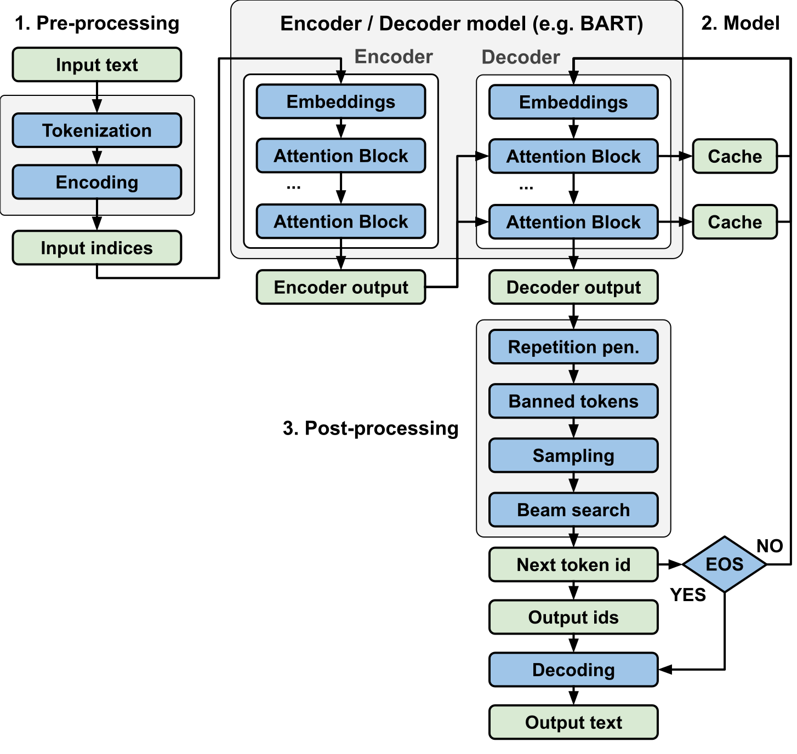
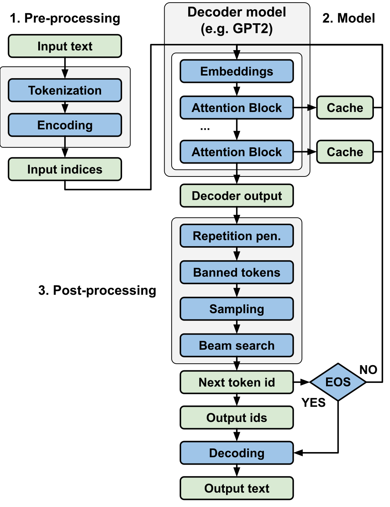
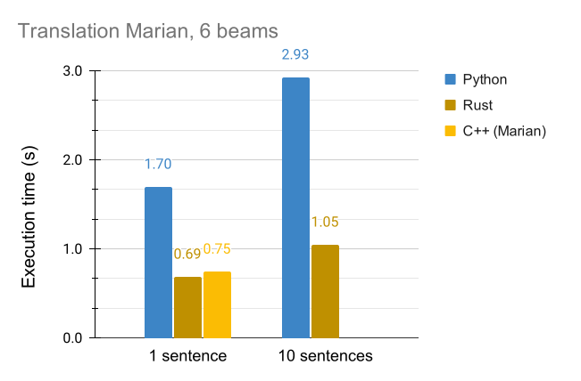
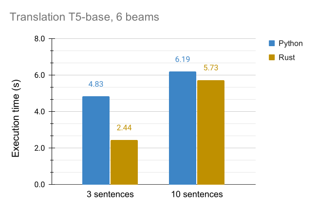

Over the past few months, text generation capabilities using Transformer-based models has been democratized by Hugging Face's Transformers [[1]](#transformers) library. A broad range of models and applications have been made available, including:
- Summarization models fine-tuned on the CNN-DailyMail [[2]](#cnndailymail) or XSUM [[3]](#xsum) datasets, including for example BART [[4]](#bart) or T5 [[5]](#t5)
- Translation, with the availability of more than a thousand models trained by the Opus-MT team from Language Technology at the University of Helsinki [[6]](#opusmt)
- Text generation, generating tokens from a prompt text, including OpenAI's GPT2 model [[7]](#gpt2)

These models offer state-of-the-art performance and can be set-up with just a few lines of code using ready-to-use pipelines in the Transformers library. This allowed a wide spread of the recent advances in the field of NLP to the industry where they can be effectively used to solve business-driven use cases.

To illustrate both translation and summarization capabilities, we'll use a <a href="https://en.wikinews.org/wiki/Astronomers_find_water_vapour_in_atmosphere_of_exoplanet_K2-18b" target="_blank">news article</a> from  WikiNews shared under  CC BY 2.5 license [[8]](#wikinews) talking about the recent discovery of water on an exoplanet called K2-18b.

#### Summarization
This article can be summarized calling the following snippet from the Transformer's Python library [[1]](#transformers), defaulting to a BART model trained on the CNN-DailyMail dataset:
```python
from transformers import pipeline
summarization_pipeline = pipeline("summarization")

summarization_pipeline(input_article)
```
returning:
>  K2-18b is the first such discovery in a planet in its star's habitable zone. It is not too hot and not too cold for liquid water to exist on a planet that orbits a star 110 light years from Earth. Scientists from the University of Montreal and a team from UCL found water in the atmosphere of the planet. The Montreal team used data from the NASA's Hubble telescope to assess changes in the light coming from the star as the planet passed between it and Earth.

#### Translation
Similarly, a translation model can be easily created to translate a sentence of this document to Spanish:
```python
from transformers import pipeline
translation_pipeline = pipeline("translation_en_to_es")

translation_pipeline("They found that certain wavelengths of light, which are usually \
 absorbed by water, weakened when the planet was in the way, indicating not only \
 does K2-18b have an atmosphere, but the atmosphere contains water in vapour form.")
```
returning: 
> Encontraron que ciertas longitudes de onda de la luz, que generalmente son absorbidas por el agua, se debilitaban cuando el planeta estaba en el camino, lo que indica que no sólo K2-18b tiene una atmósfera, sino que la atmósfera contiene agua en forma de vapor.

#### Text generation
Text can be generated using a text generation pipeline:
```python
from transformers import pipeline
text_generator = pipeline("text-generation")

print(text_generator("The majority of crustaceans are aquatic,", 
    max_length=64, 
    do_sample=False))
```
returning:
> The majority of crustaceans are aquatic, meaning they live on land, rivers, and lakes. Carnivorous crustacean species, such as those found in the Pacific Northwest, are found in all parts of the world, including the United States, Canada, Australia, New Zealand, and Japan.

This article will briefly describe the architecture of such models before diving in a comparison of the baseline Python Transformers library with a proposed Rust-based implementation: rust-bert [[9]](#rustbert)

# Overview of models

### Summarization and Translation

Translation and summarization both rely on a similar architecture, although the model weights natural vary from application to application. They are essentially made of:
1. A pre-processing pipeline mostly comprising of a tokenizer (such as Byte Pair Encoding or SentencePiece/Unigram-based) and an encoder (mapping individual tokens to a vocabulary index and other optional inputs (such as position indices)).

2. A transformer-based model, based on an encoder-decoder architecture. If you are not familiar with Transformer-based encoder-decoder architecture, I highly recommend the blog post "The Illustrated Transformer" [[10]](#illustratedtransformer). The encoder is comprised of a stack of self-attention and fully connected layers and encodes the input sequence (i.e. text to be translated or summarized) into a latent space. The decoder is made of a similar stack of self-attention layers completed with cross-attention to the encoder hidden states, allowing to leverage the representations generated during encoding. The decoder takes as an input the output sequence generated so far and the encoder output to generate the next tokens. The decoder therefore generates output tokens one at a time.

3. A generation routine, which in its simplest form will keep calling the transformer-based models to generate tokens until the sequence is completed (output of an `End Of Sequence` token). Note that the encoder only needs to be run once in this iterative process: its output is cached and re-used at each decoder generation step. In practice, more advanced algorithms are used to improve the quality of the generation, including beam search, sampling, length and repetition penalties. These methods are summarized in an excellent article from Hugging Face [[11]](#generation). Careful design of the decoder allows to not only cache the encoder states, but also parts of the keys and values in the decoder to avoid unnecessary re-calculation and speed-up the decoding process.

This iterative process is illustrated at a high level in the figure below (with slight simplifications, especially for the end of generation condition):



This process (and in the special case of BART and Marian - the model architecture itself) is identical between translation and summarization. Only the tokenization process and the model parameters differ between the two applications, showing the high versatility of this system. 

### Text generation

The process for text generation using GPT2 is very similar. However, GPT2 is a decoder-only model, and does not contain the encoder part of the transformers architectures. The model uses the starting prompt (and sequence generated so far) as only input. While it therefore does not need to compute encoder states ate cache them, it still relies on an efficient caching mechanism to avoid unnecessary re-computation of activations already computed during the generation process.

{:width="70%"}

### On the complexity of the generation routine

For both architectures, one may note the complexity of the generation routine, involving a significant number of operations beyond the model forward pass, helping to improve the quality of the generated text. However, these improvements do not come for free and incur additional computational cost in both the model forward pass (beam search increases the effective batch size) and in post-processing operations.

The Python Transformer's library already leverages Rust-based tokenizers for all its ready-to-use pipelines, therefore accelerating the preprocessing part of the system. Some benchmarks on question answering [[9]](#rustbert) indicate that the preprocessing can amount to 20% to 30% of the processing time for simple pipelines. The post-processing, also involving operations that go beyond tensor operations, is however implemented in Python in the Transformer's library. The rest of this article assesses the impact of a high-performance implementation of the entire system in Rust (therefore covering the post-processing pipeline) using the rust-bert library [[9]](#rustbert).

# A brief introduction to rust-bert

Rust-bert is essentially a Rust-native port of Hugging Face's Transformers' library [[1]](#transformers). Leveraging the `rust_tokenizers` [[12]](#rusttokenizers) library for preprocessing, it proposes implementations for state-of-the-art transformers-based models and ready-to-use pipelines. De-noising auto-encoder (BERT, Electra), autoregressive (XLNet, GPT, GPT2) and encoder-decoder models (BART, T5) have been implemented with pre-trained set of weights available on Hugging Face's model hub [[13]](#modelhub). Any Pytorch model trained on the Transformers's library can be converted to a C-array format and used by the `rust-bert` library.

These models can be used in ready-to-use pipelines, including:
- classification (e.g. sentiment analysis)
- token classification (e.g. named entities recognition)
- extractive question answering
- zero-shot classification, using a natural language inference classifier
- text generation
- conversational model
- translation
- summarization

The last text generation pipelines allow for a side-by-side comparison of the Python implementation (with Rust tokenizers) and the end-to-end Rust version. The three pipelines mentioned above can also be instantiated in a few lines of code:

#### Summarization
```rust
use rust_bert::pipelines::summarization::SummarizationModel;
let summarization_model = SummarizationModel::new(Default::default())?;

summarization_model.summarize(&input);
```

#### Translation
```rust
use rust_bert::pipelines::translation::{Language, TranslationConfig, TranslationModel};
let translation_config =
    TranslationConfig::new(Language::EnglishToSpanish, Device::cuda_if_available());
let model = TranslationModel::new(translation_config)?;

model.translate(&["They found that certain wavelengths of light, which are usually 
 absorbed by water, weakened when the planet was in the way, indicating not only 
 does K2-18b have an atmosphere, but the atmosphere contains water in vapour form."]);
```
#### Generation
```rust
use rust_bert::pipelines::text_generation::TextGenerationModel;
let model = TextGenerationModel::new(Default::default())?;

let input_context = "The majority of crustaceans are aquatic,";
model.generate(&[input_context], None);
```

These pipelines bring state-of-the-art NLP capabilities to the Rust community. Please check `rust-bert`'s [repository](https://github.com/guillaume-be/rust-bert), or the associated paper [[9]](#rustbert) if you are interested in learning more about the capabilities of the library. The rest of this article will focus on the performance comparison of the original Python-based text generation pipelines (using the Transformers library [[1]](#transformers)) and the proposed Rust-based implementation. 

# Benchmarks

The performance benchmarks proposed here will focus on the text generation task. Benchmarks have been performed for simpler pipelines (for example classifications) and are available in [[9]](#rustbert). For simple pipelines with low to no post-processing operations, there is little to gain from a Rust implementation. The forward pass through the neural network leverage the same backend (Rust bindings to the C++ Libtorch library [[14]](#tch)). Potential benefits could be gained from the pre-processing and tokenization step, but the Transformers' library uses starting from v4.0.0 Rust-based tokenizers [[15]](#tokenizers) for all its models. The outcome is a virtually identical performance between the Rust and Python implementation for tasks such as classification, token classification or question answering.

The text generation pipelines, however, do include a complex post-processing pipeline which is implemented natively in Python. Because of the iterative process involving a model forward pass and the post-processing steps, a migration of the post-processing operations to Rust and use of bindings to Python (as is the case for tokenizers) is more difficult. This is an area where a fully Rust-native, end-to-end Rust implementation may offer benefits. This section describes a few experiments aiming at quantifying how significant these benefits may be.

## Experimental setup

The experimental setup for all experiments is unchanged and described below:

| Hardware      |  |&nbsp; | &nbsp; |  Software |  |
| :---------- | :---------- |:----- | :----| :-----|:------------  |
| **CPU**     &nbsp; |  AMD 2700X       | &nbsp; &nbsp;&nbsp;| &nbsp; | **OS** &nbsp; | Windows 10 (Marian: Ubuntu 20.04) |
| **GPU**     &nbsp; | Nvidia 2070 RTX  | &nbsp; &nbsp;&nbsp;| &nbsp; | **CUDA** &nbsp; | 10.2 |
| **RAM**     &nbsp; |  32GB       | &nbsp;&nbsp;&nbsp; | &nbsp; |  **Python** &nbsp; | Python 3.7, Transformers v4.0.0rc1 |
| **Drive**     &nbsp; | NVME 970 EVO  | &nbsp; &nbsp;&nbsp;| &nbsp; | **Rust** &nbsp; | rust-bert v0.12.0 |
|     &nbsp; |   | &nbsp; | &nbsp; | **C++** &nbsp; &nbsp;&nbsp;| Opus-MT Marian Docker image |

<br/>

By default experiments are run in Windows 10, with the exception of Marian ran natively in Ubuntu 20.04 on the same hardware. All experiments are repeated at least 10 iterations, the mean is reported. In all benchmarks, a warm-up run is executed (loading model in the GPU buffer and executing a forward pass) as the first GPU buffer allocation can be significantly slower.

## Translation

Two models are used for benchmark purposes for translation: an English to Spanish model trained by the Opus-MT team [[6]](#opusmt), and the T5-base model allowing for translation (in this case, English to French) as part of its text-to-text capabilities. For all translation tasks, the source sentences are extracted from the example provided at the beginning of this article [[8]](#wikinews) (and of course identical between Python and Rust).

| Setting     |  Value   | 
| :---------- | :------- |
|  **# beams**   &nbsp;&nbsp; |   6      |
|  **sampling**   &nbsp;&nbsp; |   false     |
|  **early stopping**  &nbsp;&nbsp; |   true     |
|  **output sequences**  &nbsp;&nbsp; |   1     |

<br/>
All sentences are processed in a single batch. To illustrate the impact of the batch size and padding, a sample of 10 sentences with various lengths and a single sentences are passed to the models. Note that since translation is done with 6 beams, the effective batch size is 6x the length of the input sequences.

The figure below shows the results of the translation benchmark with the Marian English to Spanish model. For both input sizes, the Rust-based translation executes approximately 60% faster than its Python counterpart - regardless of the number of input sentences provided. Interestingly, the Rust and C++ (Marian) translation have the same performance, even though they do not share the same tensor operations backend (Marian uses its own optimized auto-differentiation engine [[16]](#marian) while the Rust version relies on bindings to the Libtorch library).

{:width="75%"}

The next figure illustrates the same experiment, taking the T5-base model (the only differences lies in the neural network architecture, the rest of the pipeline and settings remain identical). For a small effective batch size (3 input sentences), the benefits are in line with the Marian-based translation - approximately 50% faster for the Rust version. Interestingly, these benefits decrease significantly for larger effective batch sizes. This issue is still being investigated and may be cause by the handling of padding for sequences with varying length, or because T5 is a significantly larger model than Marian.

{:width="75%"}


# Final thoughts

These results highlight the potential of high-performance language for serving text generation models under low latency. This also illustrate the potential of Rust as a replacement for C++ in latency sensitive applications. Bringing performance benefits in line with C++, its memory safety, concurrency and accessibility to Machine Learning engineers make it a powerful additional choice for the deployment of performant, machine-learning powered applications.

Research efforts aiming at reducing the computational cost of deep learning models have translated in significant gains in execution speed, at only a marginal cost in the performance of these models. The proposed Rust implementation synergizes very well with this work: While techniques such as distillation or quantization are effective at reducing the cost of the forward pass through the neural network, a Rust implementation can significantly speed up the auxiliary operations (whose relative cost increases as the neural network gets optimized). Combined with Rust safe concurrency capabilities, the combination of these techniques enables a significant acceleration of text generation pipelines using state-of-the-art models.

- Benchmark text generation techniques
    - description of experimental setup (hardware and library versions)
    - description of inputs for each task + benchmark: 
        1. describe the input
        2. describe the options (mention that the defaults may be different)
        2. show the numbers
        3. comment
    - show it for text generation

- Next steps:
    - synergies with model optimization techniques (distillation, quantization, pruning)
    - synergies with optimized runtimes
    

## References
- <a name="transformers"></a>[1] [Transformers: State-of-the-Art Natural Language Processing
](https://www.aclweb.org/anthology/2020.emnlp-demos.6/), Thomas Wolf, Lysandre Debut, Victor Sanh, Julien Chaumond, Clement Delangue, Anthony Moi, Pierric Cistac, Tim Rault, Remi Louf, Morgan Funtowicz, Joe Davison, Sam Shleifer, Patrick von Platen, Clara Ma, Yacine Jernite, Julien Plu, Canwen Xu, Teven Le Scao, Sylvain Gugger, Mariama Drame, Quentin Lhoest, Alexander Rush. 
- <a name="cnndailymail"></a>[2] [Get To The Point: Summarization with Pointer-Generator Networks](http://arxiv.org/abs/1704.04368), Abigail See, Peter J. Liu, Christopher D. Manning
- <a name="xsum"></a>[3] [Don’t Give Me the Details, Just the Summary! Topic-Aware Convolutional Neural Networks for Extreme Summarization](https://www.aclweb.org/anthology/D18-1206/), Shashi Narayan, Shay B. Cohen, Mirella Lapata
- <a name="bart"></a>[4] [BART: Denoising Sequence-to-Sequence Pre-training for Natural Language Generation, Translation, and Comprehension](https://www.aclweb.org/anthology/2020.acl-main.703/), Mike Lewis, Yinhan Liu, Naman Goyal, Marjan Ghazvininejad, Abdelrahman Mohamed, Omer Levy, Veselin Stoyanov, Luke Zettlemoyer
- <a name="t5"></a>[5] [Exploring the Limits of Transfer Learning with a Unified Text-to-Text Transformer](https://arxiv.org/abs/1910.10683), Colin Raffel, Noam Shazeer, Adam Roberts, Katherine Lee, Sharan Narang, Michael Matena, Yanqi Zhou, Wei Li, Peter J. Liu
- <a name="opusmt"></a>[6] [Open neural machine translation models and web services](https://github.com/Helsinki-NLP/Opus-MT), The Opus-MT team
- <a name="gpt2"></a>[7] [Language Models are Unsupervised Multitask Learners](https://d4mucfpksywv.cloudfront.net/better-language-models/language-models.pdf), Alec Radford, Jeffrey Wu, Rewon Child, David Luan, Dario Amodei, Ilya Sutskever
- <a name="wikinews"></a>[8] [Astronomers find water vapour in atmosphere of exoplanet K2-18b](https://en.wikinews.org/wiki/Astronomers_find_water_vapour_in_atmosphere_of_exoplanet_K2-18b), WikiNews
- <a name="rustbert"></a>[9] [End-to-end NLP Pipelines in Rust](https://www.aclweb.org/anthology/2020.nlposs-1.4/), Becquin, Guillaume
- <a name="illustratedtransformer"></a>[10] [The Illustrated Transformer](http://jalammar.github.io/illustrated-transformer/), Alammar, Jay
- <a name="generation"></a>[11] [How to generate text: using different decoding methods for language generation with Transformers](https://huggingface.co/blog/how-to-generate), von Platen, Patrick
- <a name="rusttokenizers"></a>[12] [rust_tokenizers](https://github.com/guillaume-be/rust-tokenizers)
- <a name="modelhub"></a>[13] [Hugging Face model hub](https://huggingface.co/models?filter=rust)
- <a name="tch"></a>[14] [tch-rs crate](https://github.com/LaurentMazare/tch-rs), Mazare, Laurent
- <a name="tokenizers"></a>[15] [Tokenizers: Fast State-of-the-Art Tokenizers optimized for Research and Production](https://github.com/huggingface/tokenizers), The Huggingface team
- <a name="marian"></a>[16] [Marian: Fast Neural Machine Translation in C++](https://www.aclweb.org/anthology/P18-4020/), Marcin Junczys-Dowmunt, Roman Grundkiewicz, Tomasz Dwojak, Hieu Hoang, Kenneth Heafield, Tom Neckermann, Frank Seide, Ulrich Germann, Alham Fikri Aji, Nikolay Bogoychev, André F. T. Martins, Alexandra Birch

